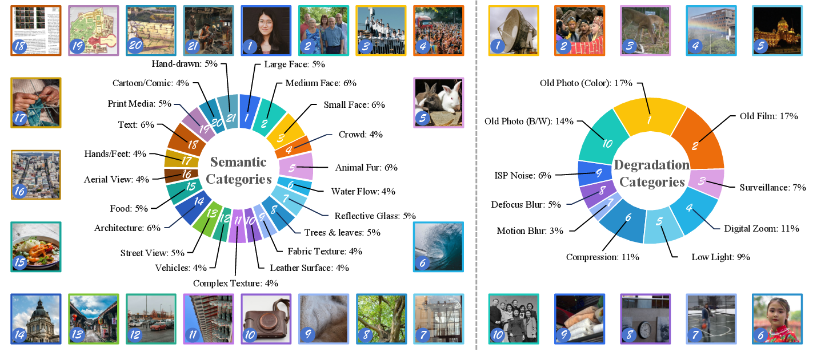

# How Far Have We Gone in Generative Image Restoration? A Study on Its Capability, Limitations, and Evaluation Practices

<div align="center">
  <a href="https://arxiv.org/abs/2603.05010"></a>
  <a href="https://drive.google.com/drive/folders/13rqCsIv7xYRCw7HJcr53WZAZ4Kpc1VFm?usp=sharing"></a>
  <a href="https://pan.baidu.com/s/1l0lsKFV-vK042w-VbX-95Q?pwd=QoNB"></a>
</div>

<div align="center">
  <p>
    Xiang Yin<sup>1</sup>,
    Jinfan Hu<sup>2,3</sup>,
    <a href="https://zhiyuanyou.github.io/">Zhiyuan You</a><sup>2,4</sup>,
    Kainan Yan<sup>2,3</sup>,
    Yu Tang<sup>2</sup>,
    <a href="https://scholar.google.com.hk/citations?user=OSDCB0UAAAAJ">Chao Dong</a><sup>2,5</sup>,
    <a href="https://www.jasongt.com/">Jinjin Gu</a><sup>6</sup>
  </p>
</div>

<div align="center">
  <sup>1</sup>Fudan University &nbsp;&nbsp;
  <sup>2</sup>Shenzhen Institutes of Advanced Technology, CAS &nbsp;&nbsp;
  <sup>3</sup>University of the Chinese Academy of Sciences 
  <sup>4</sup>Multimedia Laboratory, The Chinese University of Hong Kong <br>
  <sup>5</sup>Shenzhen University of Advanced Technology &nbsp;&nbsp;
  <sup>6</sup>INSAIT, Sofia University "St. Kliment Ohridski"
</div>

<br>

<div align="center">
  
  <p><em>Overview of the dataset across <b>Semantic</b> and <b>Degradation</b> dimensions.</em></p>
</div>

## 📢 News

- **[2026/08/14]** 🎉 The six multi-dimensional IQA checkpoints are now available in the existing Baidu Netdisk folder.
- **[2026/06/16]** 🎉 Training, inference, and evaluation code is released.
- **[2026/05/11]** 🎉 Dataset is now publicly available on Google Drive and Baidu Netdisk.
- **[2026/03]** 🎉 Our paper has been accepted to **CVPR 2026 Findings**.
- **[2026/03/04]** Repository initialized.

## 📋 TODO

- [x] Release the dataset
- [x] Release the training and evaluation code
- [x] Release the multi-dimensional IQA checkpoints

## 🔎 Overview

Our IQA model is built on the [DeQA-Score](https://github.com/zhiyuanyou/DeQA-Score)
framework. Following the paper, the two *bipolar* dimensions (Detail and Sharpness,
scored `-3 … +3` with `0` being best) are each decoupled into two *unipolar* metrics,
giving **six** independently trained LoRA models:

| Checkpoint (`checkpoints/`) | Dimension | Range | Source |
| :--- | :--- | :--- | :--- |
| `deqa_lora_overall_score` | Overall quality       | 0 – 4 | Overall |
| `deqa_lora_semantics`     | Semantics             | 0 – 4 | Semantics |
| `deqa_lora_detail`        | Detail Completeness   | under-generation | Detail (`≤ 0`) |
| `deqa_lora_content`       | Content Conciseness   | over-generation  | Detail (`≥ 0`) |
| `deqa_lora_visual`        | Visual Clarity        | blur side        | Sharpness (`≤ 0`) |
| `deqa_lora_sharpness`     | Sharpness Naturalness | over-sharpen side | Sharpness (`≥ 0`) |

## 📦 Dataset

The dataset can be downloaded from either of the following sources:

| Source | Link | Notes |
| :--- | :--- | :--- |
| Google Drive | [Download](https://drive.google.com/drive/folders/13rqCsIv7xYRCw7HJcr53WZAZ4Kpc1VFm?usp=sharing) |  |
| Baidu Netdisk | [Download](https://pan.baidu.com/s/1l0lsKFV-vK042w-VbX-95Q?pwd=QoNB) | Extraction code: `QoNB` |

## ⚙️ Installation

```shell
git clone https://github.com/yxyuanxiao/how-far-have-we-gone.git
cd how-far-have-we-gone
pip install -e .                       # inference / evaluation
pip install -e ".[train]"              # + training dependencies
pip install flash_attn --no-build-isolation
```

The models are based on **mPLUG-Owl2**. Download the base weights from
[Huggingface mPLUG-Owl2](https://huggingface.co/MAGAer13/mplug-owl2-llama2-7b).

## 📥 Checkpoints

The six LoRA checkpoints are available in the same
[Baidu Netdisk folder](https://pan.baidu.com/s/1l0lsKFV-vK042w-VbX-95Q?pwd=QoNB)
as the dataset (extraction code: `QoNB`). Download them into `checkpoints/` so each model lives at
`checkpoints/deqa_lora_<dimension>/`.

## 🗂️ Directory Layout

The scripts run from the repository root and expect the following sibling folders:

```
workspace/
├── how-far-have-we-gone/            # this repo
│   ├── checkpoints/                 # downloaded LoRA checkpoints (deqa_lora_*)
│   └── data_preprocess/             # config + scripts; generated metas (see its README)
├── data/                            # released dataset (download; dataset_info.json + images)
│   ├── Real_World/
│   │   ├── dataset_info.json        # annotations (released)
│   │   ├── lq/                      # low-quality inputs
│   │   └── results/<method>/        # restored images (20 methods)
│   ├── Simulation/
│   │   ├── dataset_info.json
│   │   ├── lq/
│   │   └── results/<method>/
│   └── KONIQ/ SPAQ/ KADID10K/       # for overall-score training (from the DeQA-Score release)
└── ModelZoo/
    └── mplug-owl2-llama2-7b/        # base model (from Huggingface)
```

Image paths inside the metas are relative to the `data/` root. Paths are configured
at the top of each script in `scripts/`; adjust `--model-base`, `--image_folder`,
and `--root-dir` if your layout differs. The standard IQA datasets (KONIQ / SPAQ /
KADID10K) are only needed for the overall-score model — download them from the
[DeQA-Score dataset release](https://huggingface.co/datasets/zhiyuanyou/Data-DeQA-Score)
and place them under `data/`.

## 🧮 Data Preprocessing

The annotation-to-softlabel pipeline (and where to place the downloaded metas) is
documented in [`data_preprocess/README.md`](data_preprocess/README.md).

## 🚀 Training

Each dimension is trained with its own script (argument: GPU id(s)).

```shell
sh scripts/train_overall_score.sh 0,1
sh scripts/train_semantics.sh     0,1
sh scripts/train_detail.sh        0,1
sh scripts/train_content.sh       0,1
sh scripts/train_visual.sh        0,1
sh scripts/train_sharpness.sh     0,1
```

The overall-score model is additionally trained on the standard IQA datasets
(KONIQ / SPAQ / KADID10K); see the note at the top of `scripts/train_overall_score.sh`.

## 🔮 Inference

After downloading (or training) a checkpoint, run inference for that dimension
(argument: a single GPU id). Predictions are written to `results/`.

```shell
sh scripts/infer_overall_score.sh 0
sh scripts/infer_semantics.sh     0
sh scripts/infer_detail.sh        0
sh scripts/infer_content.sh       0
sh scripts/infer_visual.sh        0
sh scripts/infer_sharpness.sh     0
```

Each sub-dimension passes its own question to `iqa_eval.py` via `--prompt` (set in each infer script).

## 📊 Evaluation

Compute SRCC / PLCC against the human annotations:

```shell
sh scripts/eval_overall_score.sh
sh scripts/eval_semantics.sh
sh scripts/eval_detail.sh
sh scripts/eval_content.sh
sh scripts/eval_visual.sh
sh scripts/eval_sharpness.sh
```

## 🙏 Acknowledgements

This code is built on [DeQA-Score](https://github.com/zhiyuanyou/DeQA-Score), which is in turn based on [Q-Align](https://github.com/Q-Future/Q-Align) and [mPLUG-Owl2](https://github.com/X-PLUG/mPLUG-Owl). Sincerely thanks for these awesome works.

## 📚 Citation

If you find our work useful for your research, please consider citing:

```bibtex
@InProceedings{yin2026far,
    author    = {Yin, Xiang and Hu, Jinfan and You, Zhiyuan and Yan, Kainan and Tang, Yu and Dong, Chao and Gu, Jinjin},
    title     = {How far have we gone in Generative Image Restoration? A study on its capability, limitations and evaluation practices},
    booktitle = {Proceedings of the IEEE/CVF Conference on Computer Vision and Pattern Recognition (CVPR) Findings},
    month     = {June},
    year      = {2026},
    pages     = {4909-4919}
}

@inproceedings{deqa_score,
  title     = {Teaching Large Language Models to Regress Accurate Image Quality Scores using Score Distribution},
  author    = {You, Zhiyuan and Cai, Xin and Gu, Jinjin and Xue, Tianfan and Dong, Chao},
  booktitle = {IEEE/CVF Conference on Computer Vision and Pattern Recognition},
  year      = {2025}
}
```

## 📬 Contact

For questions or discussions, please open an issue in this repository.
